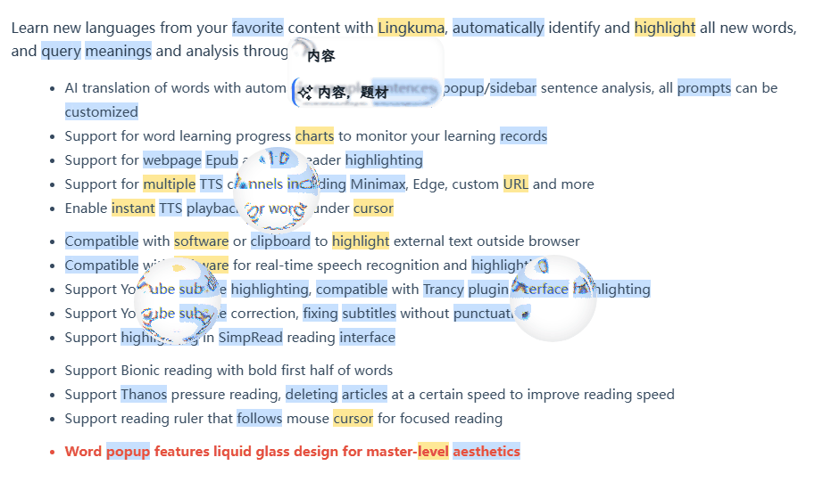
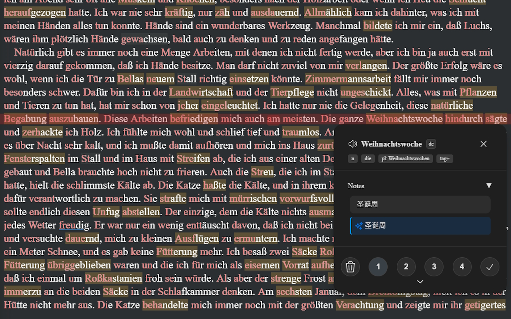

---
# https://vitepress.dev/reference/default-theme-home-page
layout: home

hero:
  name: "Lingkuma"
  text: "在網頁學習任何語言"
  # tagline: 💡 靈感來自 Lingq 的標示與翻譯，更支援：AI 解析、PDF、EPUB、Youtube……
  image:
    src: /hero.png
    alt: Lingkuma
  actions:
    - theme: brand
      text: 介紹與安裝
      link: ./init/Lingkuma/Lingkuma
    - theme: alt
      text: 基本用法
      link: ./intro/start/start

features:
  - title: 最新功能
    details: 即將推出重大更新！
    link: ./init/new/new
  - title: 多平台支援
    details: 支援 iOS、Android、Chrome、Firefox
    link: ./more/platform/platform
  - title: 電子書閱讀
    details: 支援 EPUB、PDF、Youtube
    link: ./intro/ebook/ebook
  - title: 即時字幕醒目標示
    details: 支援即時字幕醒目標示
    link: ./more/WindowsCaptions/WindowsCaptions
---

::: tabs
== Chrome
[Chrome Store](https://chromewebstore.google.com/detail/lingkuma-language-learnin/denpakphibjnpnnkcnhiniicbffdamfh)

== Edge
[Edge Store](https://microsoftedge.microsoft.com/addons/detail/lingkuma-language-learn/jmdokmfnifcbgmdgodgokigjkaagnmik)
== Firefox
[Firefox Store](https://addons.mozilla.org/en-US/firefox/addon/lingkuma-language-learning/)
== iOS
[多平台使用教學](./more/platform/platform)
== Android
[多平台使用教學](./more/platform/platform)
:::

::: tabs
== Youtube

<iframe width="500" height="315" src="https://www.youtube.com/embed/RHh3Upabtfk?si=NI2Bquz66PzQZe2H" title="YouTube video player" frameborder="0" allow="accelerometer; autoplay; clipboard-write; encrypted-media; gyroscope; picture-in-picture; web-share" referrerpolicy="strict-origin-when-cross-origin" allowfullscreen></iframe>

== bilibili

<iframe src="//player.bilibili.com/player.html?bvid=BV1RGZ8YbEGh" scrolling="no" border="0" frameborder="no" framespacing="0" allowfullscreen="true" width="500" height="315" ></iframe>

:::

::: tabs
== 動圖展示

== Bionic ADHD 閱讀輔助

== YouTube 字幕高亮

:::

