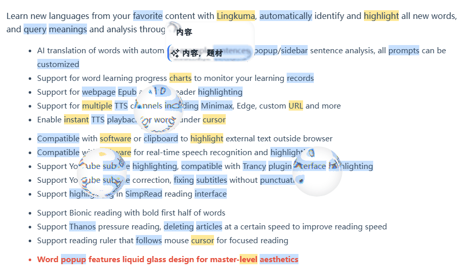

---
# https://vitepress.dev/reference/default-theme-home-page
layout: home

hero:
  name: "Lingkuma"
  text: "ウェブサイトで学ぶ、あらゆる言語"
  # tagline: 💡 Lingqにインスパイアされたハイライトと翻訳、さらにAI解析、PDF、EPUB、Youtube対応 ·····
  image:
    src: /hero.png
    alt: Lingkuma
  actions:
    - theme: brand
      text: 紹介&インストール
      link: ./init/Lingkuma/Lingkuma
    - theme: alt
      text: 基本的な使い方
      link: ./intro/start/start

features:
  - title: 最新機能
    details: 大きなアップデートが来る？
    link: ./init/new/new
  - title: マルチプラットフォーム対応
    details: iOS、Android、Chrome、Firefoxに対応
    link: ./more/platform/platform
  - title: 電子書籍リーディング
    details: Epub、Pdf、Youtubeに対応
    link: ./intro/ebook/ebook
  - title: リアルタイム字幕ハイライト
    details: リアルタイム字幕ハイライトに対応
    link: ./more/WindowsCaptions/WindowsCaptions
---

::: tabs
== Chrome
[Chrome Store](https://chromewebstore.google.com/detail/lingkuma-language-learnin/denpakphibjnpnnkcnhiniicbffdamfh)

== Edge
[Edge Store](https://microsoftedge.microsoft.com/addons/detail/lingkuma-language-learn/jmdokmfnifcbgmdgodgokigjkaagnmik)
== Firefox
[Firefox Store](https://addons.mozilla.org/en-US/firefox/addon/lingkuma-language-learning/)
== ios
[マルチプラットフォーム使用チュートリアル](./more/platform/platform)
== Android
[マルチプラットフォーム使用チュートリアル](./more/platform/platform)
:::

::: tabs
== Youtube

<iframe width="100%" height="315" style="max-width: 100%;" src="https://www.youtube.com/embed/RHh3Upabtfk?si=NI2Bquz66PzQZe2H" title="YouTube video player" frameborder="0" allow="accelerometer; autoplay; clipboard-write; encrypted-media; gyroscope; picture-in-picture; web-share" referrerpolicy="strict-origin-when-cross-origin" allowfullscreen></iframe>

== bilibili

<iframe src="//player.bilibili.com/player.html?bvid=BV1RGZ8YbEGh" scrolling="no" border="0" frameborder="no" framespacing="0" allowfullscreen="true" width="100%" height="315" style="max-width: 100%;"></iframe>

:::

::: tabs
== アニメーション表示

== Bionic ADHD読書補助

== Youtube 字幕ハイライト

:::

