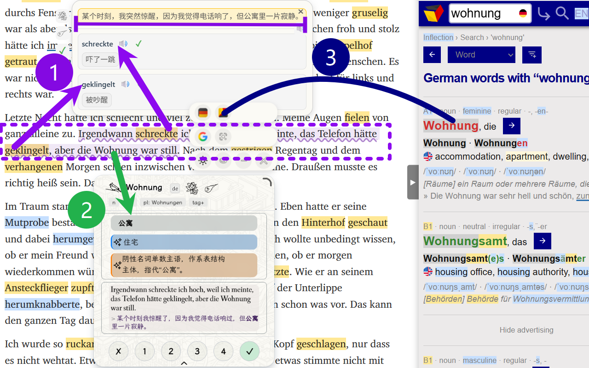
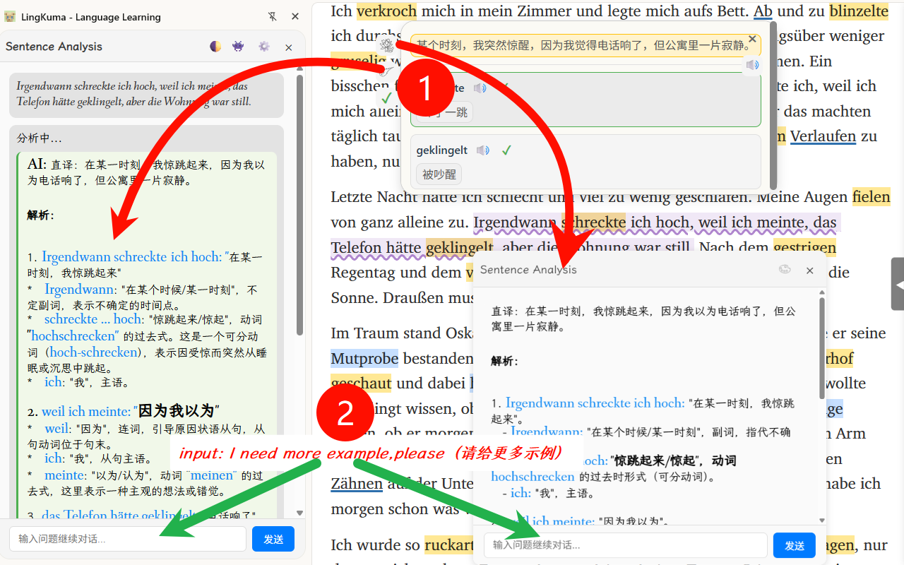

# 最新アップデート紹介：

1. ## クイック文切り替え
    - 
2. ## 品詞ハイライト
    - 
3. ## マルチキー管理/ポーリング
    - 
4. ## Youtube没入型字幕
    - 
5. ## 文の爆発
	- 
6. ## 文の解析が対話可能
	- 
7. ## カスタムフレーズハイライト
    - 手動でフレーズをドラッグ選択してハイライトを作成
    - 日本語のカスタム分かち書き、英語フレーズ、すべてハイライト可能
8. ## 外部辞書検索カプセル
    - AIが好きではありませんか？従来のウェブサイト検索にワンクリックでアクセス
    - カスタムウェブサイトを自由に追加可能
9. ## デュアルAI推奨
	1.  - 翻訳と解析、別々に見る方が良いです
10. ## より多くのリキッドグラススタイル
	1. 
		1. 
11. ## より多くの背景パターンと背景画像
	1. 
		1. 
