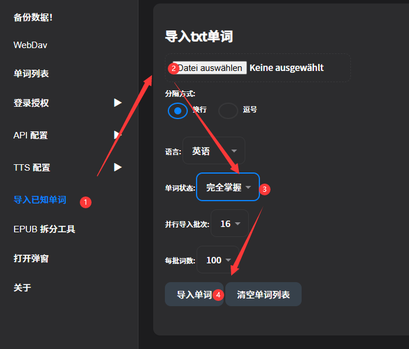

# スタートガイド


<br>

>サンプルハイライトテキスト
::: tabs
== English
Alice was beginning to get very tired of sitting by her sister on the bank. She had nothing to do. Once or twice she had peeped into the book her sister was reading. But it had no pictures or conversations in it. "And what is the use of a book," thought Alice, "without pictures or conversations?"
*— Alice in Wonderland*
== Japanese
土手で姉の傍らに座り、何もしないことに、アリスはもううんざりし始めていた。姉の読んでいる本をちらちらと二、三度見てみたものの、絵も会話もなく、「絵も会話もない本なんて、一体何の価値があるのかしら?」とアリスは心の中で思った。
*— Alice in Wonderland*

== ZH-CN
爱丽丝坐在河岸上姐姐的身旁,无所事事,开始感到厌倦了。她偶尔瞥一眼姐姐正在读的书,但书里既没有图画也没有对话。"一本书,"爱丽丝想,"既没有图画又没有对话,有什么用呢?"
*— 爱丽丝梦游仙境*

== ZH-HK
愛麗絲坐在河岸上姊姊的身旁,無所事事,開始感到厭倦了。她偶爾瞥一眼姊姊正在讀的書,但書裡既沒有圖畫也沒有對話。「一本書,」愛麗絲想,「既沒有圖畫又沒有對話,有什麼用呢?」
*— 愛麗絲夢遊仙境*

== Korean
앨리스는 강둑에서 언니 옆에 앉아 할 일이 없어 매우 지루해지기 시작했습니다. 한두 번 언니가 읽고 있는 책을 들여다보았지만, 그 책에는 그림도 대화도 없었습니다. "그림도 대화도 없는 책이," 앨리스는 생각했습니다, "무슨 소용이 있을까?"
*— 이상한 나라의 앨리스*

== German
Alice wurde allmählich sehr müde davon, neben ihrer Schwester am Ufer zu sitzen und nichts zu tun zu haben. Ein- oder zweimal hatte sie in das Buch hineingeschaut, das ihre Schwester las, aber es hatte weder Bilder noch Gespräche darin. "Und was nützt ein Buch", dachte Alice, "ohne Bilder oder Gespräche?"
*— Alice im Wunderland*

== Spanish
Alicia comenzaba a cansarse mucho de estar sentada junto a su hermana en la orilla del río sin tener nada que hacer. Una o dos veces había echado un vistazo al libro que estaba leyendo su hermana, pero no tenía dibujos ni conversaciones. "¿Y de qué sirve un libro", pensó Alicia, "sin dibujos ni conversaciones?"
*— Alicia en el País de las Maravillas*

== French
Alice commençait à se lasser beaucoup d'être assise à côté de sa sœur sur la berge et de n'avoir rien à faire. Une ou deux fois, elle avait jeté un coup d'œil au livre que lisait sa sœur, mais il n'y avait ni images ni conversations dedans. "Et à quoi sert un livre", pensa Alice, "sans images ni conversations ?"
*— Alice au Pays des Merveilles*

== Italian
Alice iniziava a stancarsi molto di stare seduta accanto a sua sorella sulla riva e di non avere nulla da fare. Una o due volte aveva sbirciato nel libro che stava leggendo sua sorella, ma non aveva né figure né conversazioni. "E a che serve un libro", pensò Alice, "senza figure o conversazioni?"
*— Alice nel Paese delle Meraviglie*

== Russian
Алиса начинала очень уставать от того, что сидела рядом с сестрой на берегу и ей нечего было делать. Раз или два она заглядывала в книгу, которую читала сестра, но в ней не было ни картинок, ни разговоров. "И какая польза от книги", подумала Алиса, "без картинок и разговоров?"
*— Алиса в Стране чудес*


:::


## なぜ上の単語がすべて青色なのですか？
::: tip
それらの単語を知らないからです。クリックして検索すると、単語が黄色に変わります。単語を知っている場合は、ステータスを「チェックマーク✅」に変更すると、単語がハイライトされなくなります。
:::

::: warning
私は**初心者**ではありません。CET-4のように、これらの単語の**多く**をすでに知っています。一括操作はできますか？
:::

::: tip
はい、次のように操作できます
:::
### 既知単語リストをインポート
::: tabs
== 1. 既知単語リストをダウンロードまたは作成
他の場所に既知単語のデータがある場合は、次のようなテキストに整理できます。1行に1単語
``` txt
apple
banana
orange
pear
```
> 例 english.txt

以下から英語四六級単語リストをダウンロードすることもできます

[英語四六級単語リストファイルダウンロード](https://www.notion.so/1b899894aa16801fa623f91527e590f3?pvs=21)

== 2. 単語リストをインポート

異なる単語ステータスに応じてバッチでインポートできます。単語ステータスには 0 1 2 3 4 5 の種類があります




:::


## なぜAI翻訳が失敗したり、空になったりするのですか？
    内蔵の無料APIが無効になりました。独自のAPIを取得する必要があります


## なぜAI翻訳が不正確なのですか？


デフォルトのAIは智谱の無料AIなので、あまり賢くありません。Gemini-2.5-flashまたはDeepSeek-v3以上のレベルの大規模モデルAPIに変更してください。


知乎野榜：[大規模言語モデル-論理能力横評](https://zhuanlan.zhihu.com/p/1954578674109096588)
AIランキング：[LMArena（VPN必要）](https://lmarena.ai/)
## API（インターフェース）を取得するにはどうすればよいですか？

::: tabs
==  Ohmygptを使用
OhmygptにはChatGPT、Gemini、Claude、DeepSeekなど、ほぼすべてのAPIがあります。
プラグイン内で認証コードを貼り付けてログインすると、すぐに使用できます。

<iframe width="560" height="315" src="https://www.youtube.com/embed/RHh3Upabtfk?si=mt_hZksXLw26XpKb&amp;start=296" title="YouTube video player" frameborder="0" allow="accelerometer; autoplay; clipboard-write; encrypted-media; gyroscope; picture-in-picture; web-share" referrerpolicy="strict-origin-when-cross-origin" allowfullscreen></iframe>


==  DeepSeek

<iframe src="//player.bilibili.com/player.html?bvid=BV1RGZ8YbEGh&t=294" scrolling="no" border="0" frameborder="no" framespacing="0" allowfullscreen="true" width="560" height="315"></iframe>


== その他
ChatGPT、Gemini、Claude、Qwen、DeepSeekから自分で大規模言語モデルAPIを申請し、DeepSeekのビデオチュートリアルと同じように設定すれば使用できます。

:::

## 外部辞書検索の使い方は？


画像の4番の赤い点の位置をクリックして、カプセル機能をトリガーします。  
また、スイッチ設定でカプセルをデフォルトで展開することもできます

カプセルのカスタマイズ：  
設定-ポップアップ設定-カプセル設定  
ここで複数層のカプセル、複数の表示方法を追加し、任意のサードパーティ辞書などのウェブサイトをカスタマイズできます

## 日本語の分かち書きが細かすぎて不正確です。

上の画像の3番の赤い点の位置で、マウスでテキストをドラッグ選択した後、ポップアップする「create」ボタンをクリックしてカスタムハイライトを作成します。


## 翻訳スタイルを変更するには？

設定-API設定 内のPrompt呪文を、希望するスタイルと翻訳方法に変更します。  
スイッチ設定で2つのAIプロンプトボックスを有効にでき、1つを翻訳用、もう1つを文法解析用に使用できます


## 例文、Tagの内容に誤りがある場合、翻訳をリセットするには？

例文、tagを削除して、単語を再度クリックしてください。


## 特定言語のハイライトを有効/無効にするには？
ここで：


## ポップアップと単語の間に隙間がある

スイッチ設定でgap値を変更できます。目的は次の行の文章を隠さないようにするためです


## Miniウィンドウのボタンはどこですか？

すべてのボタンはフローティング表示されます；位置は変更される可能性があります；

ボタン1：既知ステータスの切り替え


ボタン2: 文章翻訳を表示


ボタン3: AI解析


ボタン4: ウィンドウを拡大


## ウィンドウをズームするには？

ズームアルゴリズムはこの値 `1 / (ページDPR/Custom DPR)` です。2K画面のページDPRは2；iPhoneのDPRは3；一部のスマートフォンは2または1.8です；したがって、ウィンドウの異常を調整したり、手動で拡大縮小したりするために使用できます。


## ポップアップの背景を変更するには？

カスタム背景の場合、画像の色に応じて黒テーマまたは白テーマに固定してください。そうしないとコントラストが不足し、読みにくくなります。
svg、png、gif、mp4などに対応


> この画像はオフ


## マウスホバーでリアルタイムに小窓を表示するには？

クリックのみモードをオフにし、マウスが小窓から離れると自動的に閉じるようにします。Miniウィンドウと組み合わせて使用することをお勧めします


