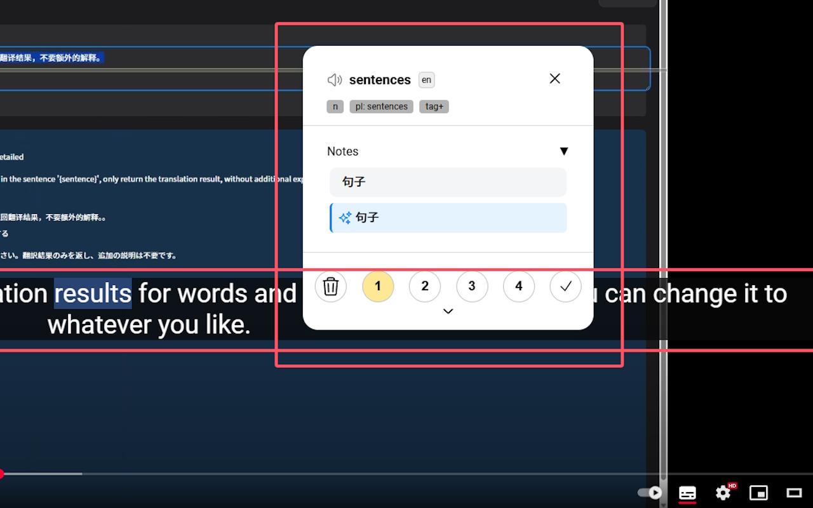

---
# https://vitepress.dev/reference/default-theme-home-page
layout: home

hero:
  name: "Lingkuma"
  text: "在网页学习任何语言"
  # tagline: 💡 启发于 Lingq 高亮，翻译 但：AI解析，PDF，EPUB，Youtueb ·····
  image:
    src: /hero.png
    alt: Lingkuma
  actions:
    - theme: brand
      text: 介绍&安装
      link: ./init/Lingkuma/Lingkuma
    - theme: alt
      text: 基本用法
      link: ./intro/start/start

features:
  - title: 最新功能
    details: 大的要来了吗？
    link: ./init/new/new
  - title: 多平台支持
    details: 支持Ios，Android，Chrome，Firefox
    link: ./more/platform/platform
  - title: 电子书阅读
    details: 支持Epub，Pdf，Youtube
    link: ./intro/ebook/ebook
  - title: 实时字幕高亮
    details: 支持实时字幕高亮
    link: ./more/WindowsCaptions/WindowsCaptions
---

::: tabs
== Chrome
[Chrome Store](https://chromewebstore.google.com/detail/lingkuma-language-learnin/denpakphibjnpnnkcnhiniicbffdamfh)

== Edge
[Edge Store](https://microsoftedge.microsoft.com/addons/detail/lingkuma-language-learn/jmdokmfnifcbgmdgodgokigjkaagnmik)
== Firefox
[Firefox Store](https://addons.mozilla.org/en-US/firefox/addon/lingkuma-language-learning/)
== ios
[多平台使用教程](./more/platform/platform)
== 安卓
[多平台使用教程](./more/platform/platform)
:::

::: tabs
== Youtube

<iframe width="100%" height="315" style="max-width: 100%;" src="https://www.youtube.com/embed/RHh3Upabtfk?si=NI2Bquz66PzQZe2H" title="YouTube video player" frameborder="0" allow="accelerometer; autoplay; clipboard-write; encrypted-media; gyroscope; picture-in-picture; web-share" referrerpolicy="strict-origin-when-cross-origin" allowfullscreen></iframe>

== bilibili

<iframe src="//player.bilibili.com/player.html?bvid=BV1RGZ8YbEGh" scrolling="no" border="0" frameborder="no" framespacing="0" allowfullscreen="true" width="100%" height="315" style="max-width: 100%;"></iframe>

:::

::: tabs
== 动图展示

== Bionic ADHD阅读辅助

== Youtube 字幕高亮

:::

