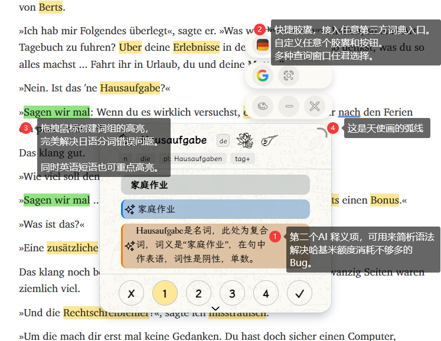

# 最新更新介绍：

1. ## 悬浮按钮&性能优化
每个页面高亮状态独立，并默认关闭高亮，不启动时不占用任何性能

2. ## 快捷句子切换
    - 
3. ## 词性高亮
    - 
4. ## 多密钥管理/轮询
    - 
5. ## Youtube沉浸字幕
    - 
6. ## 句子爆炸
	- 
7. ## 句子解析可对话
	- 
8. ## 自定义词组高亮
    - 可以手动拖选词组然后创建高亮
    - 日语自定义分词，英语词组，统统可以高亮
9. ## 外部词典查词胶囊
    - 不喜欢AI？传统网站查询一键直达
    - 可任意添加自定义网站
    - 
10. ## 双AI推荐
	1.  - 翻译和解析，分开看比较好
11. ## 更多液态玻璃样式
	1. 
		1. 
12. ## 更多背景图案和背景图片
	1. 
		1. 
