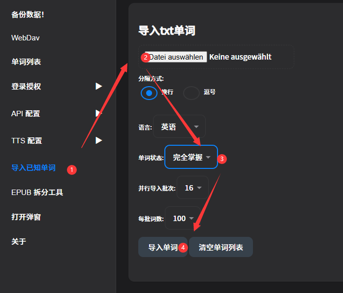

# 上手指南

  
<br>

>示例高亮文本
::: tabs
== English
Alice was beginning to get very tired of sitting by her sister on the bank, and of having nothing to do: once or twice she had peeped into the book her sister was reading, but it had no pictures or conversations in it, “and what is the use of a book,” thought Alice “without pictures or conversations?”
*— Alice in Wonderland*
== Japanese
土手で姉の傍らに座り、何もしないことに、アリスはもううんざりし始めていた。姉の読んでいる本をちらちらと二、三度見てみたものの、絵も会話もなく、「絵も会話もない本なんて、一体何の価値があるのかしら？」とアリスは心の中で思った。
*— Alice in Wonderland* 

== ZH-CN
爱丽丝坐在河岸上姐姐的身旁，无所事事，开始感到厌倦了。她偶尔瞥一眼姐姐正在读的书，但书里既没有图画也没有对话。"一本书，"爱丽丝想，"既没有图画又没有对话，有什么用呢？"
*— 爱丽丝梦游仙境*

== ZH-HK
愛麗絲坐在河岸上姊姊的身旁，無所事事，開始感到厭倦了。她偶爾瞥一眼姊姊正在讀的書，但書裡既沒有圖畫也沒有對話。「一本書，」愛麗絲想，「既沒有圖畫又沒有對話，有什麼用呢？」
*— 愛麗絲夢遊仙境*

== Korean
앨리스는 강둑에서 언니 옆에 앉아 할 일이 없어 매우 지루해지기 시작했습니다. 한두 번 언니가 읽고 있는 책을 들여다보았지만, 그 책에는 그림도 대화도 없었습니다. "그림도 대화도 없는 책이," 앨리스는 생각했습니다, "무슨 소용이 있을까?"
*— 이상한 나라의 앨리스*

== German
Alice wurde allmählich sehr müde davon, neben ihrer Schwester am Ufer zu sitzen und nichts zu tun zu haben. Ein- oder zweimal hatte sie in das Buch hineingeschaut, das ihre Schwester las, aber es hatte weder Bilder noch Gespräche darin. "Und was nützt ein Buch", dachte Alice, "ohne Bilder oder Gespräche?"
*— Alice im Wunderland*

== Spanish
Alicia comenzaba a cansarse mucho de estar sentada junto a su hermana en la orilla del río sin tener nada que hacer. Una o dos veces había echado un vistazo al libro que estaba leyendo su hermana, pero no tenía dibujos ni conversaciones. "¿Y de qué sirve un libro", pensó Alicia, "sin dibujos ni conversaciones?"
*— Alicia en el País de las Maravillas*

== French
Alice commençait à se lasser beaucoup d'être assise à côté de sa sœur sur la berge et de n'avoir rien à faire. Une ou deux fois, elle avait jeté un coup d'œil au livre que lisait sa sœur, mais il n'y avait ni images ni conversations dedans. "Et à quoi sert un livre", pensa Alice, "sans images ni conversations ?"
*— Alice au Pays des Merveilles*

== Italian
Alice iniziava a stancarsi molto di stare seduta accanto a sua sorella sulla riva e di non avere nulla da fare. Una o due volte aveva sbirciato nel libro che stava leggendo sua sorella, ma non aveva né figure né conversazioni. "E a che serve un libro", pensò Alice, "senza figure o conversazioni?"
*— Alice nel Paese delle Meraviglie*

== Russian
Алиса начинала очень уставать от того, что сидела рядом с сестрой на берегу и ей нечего было делать. Раз или два она заглядывала в книгу, которую читала сестра, но в ней не было ни картинок, ни разговоров. "И какая польза от книги", подумала Алиса, "без картинок и разговоров?"
*— Алиса в Стране чудес*


:::


## 为什么上面单词都是蓝色的？
::: tip
因为这些单词你都不认识，你可以点击查询，然后单词就变成了黄色。 如果你认识这个单词，可以将状态改成“对号✅”，这样单词就不会高亮。
:::

::: warning
我不是**初学者**，我已经认识**很多**这些单词，比如CET-4。可以批量操作吗？
:::

::: tip
可以，像下面这样操作就行了
:::
### 导入已知词库
::: tabs
== 1. 下载或者制作已知词库
如果你在其他地方有已知单词的数据，可以整理成如下文本，每个单词一行
``` txt
apple
banana
orange
pear
```
> 示例 english.txt

如果也可在下面下载英语四级词库

[英语四六级词库文件下载](https://www.notion.so/1b899894aa16801fa623f91527e590f3?pvs=21)

== 2. 导入词库

可以分批按照不同的单词状态进行导入，单词状态有 0 1 2 3 4 5 种类别




:::

  
## 为什么AI翻译失败，或者为空？
    内置的免费API失效了，你需要获取自己的API


## 为什么AI翻译不准？


因为默认AI是智谱的免费AI，所以很傻。请你换成Gemini-2.5-flash 或者DeepSeek-v3 以上等级的大模型API。


知乎野榜：[大语言模型-逻辑能力横评](https://zhuanlan.zhihu.com/p/1954578674109096588)  
AI排行榜：[LMArena（需要科学上网）](https://lmarena.ai/)  
## 我如何获取API(接口)？

::: tabs
==  使用 Ohmygpt
ohmygpt内有Chatgpt, Gemini, Claude, DeepSeek 等几乎所有API。  
插件内粘贴授权码登录后，可直接使用。

<iframe width="560" height="315" src="https://www.youtube.com/embed/RHh3Upabtfk?si=mt_hZksXLw26XpKb&amp;start=296" title="YouTube video player" frameborder="0" allow="accelerometer; autoplay; clipboard-write; encrypted-media; gyroscope; picture-in-picture; web-share" referrerpolicy="strict-origin-when-cross-origin" allowfullscreen></iframe>


==  DeepSeek

<iframe src="//player.bilibili.com/player.html?bvid=BV1RGZ8YbEGh&t=294" scrolling="no" border="0" frameborder="no" framespacing="0" allowfullscreen="true" width="560" height="315"></iframe>


== 其他
您可以去Chatgpt，Gemini，Claude，Qwen，DeepSeek 自行申请大模型API，和Deepseek里的视频教程一样配置好后即可使用。

:::

## 如何用外部查词？


点击图中 4 号红点位置，触发胶囊功能。  
同时也可以在开关设置内默认展开胶囊

胶囊自定义：  
设置-弹窗设置-胶囊设置  
这里可以添加多层胶囊，多种查看方式，自定义任意第三方词典等网站，

## 日语分词太碎，不准。

如上图 3 号红点位置，鼠标拖选文本后，点击弹出的"create" 按钮创建自定义高亮。


## 如何更改翻译风格？

设置-API 配置 里面的Prompt咒语，改成你想要的风格，以及你想要的翻译方式。  
开关设置内可以开启两个AI提示框，你可以一个用来翻译，一个用来解析语法


## 例句，Tag 内容有错，翻译如何重置？

删除例句，tag，并重新点击单词即可。


## 如何开启关闭某语言的高亮？
这里：


## 弹窗和单词有间隙

开关设置处可以更改gap 值，目的用于防止挡住下一行句子


## Mini 窗口的按钮呢？

所有按钮都是悬浮显示；位置可能会更改；

按钮 1：已知状态切换


按钮 2: 显示句子翻译


按钮 3: AI 解析


按钮 4: 放大窗口


## 如何缩放窗口？

缩放算法是这里的值 `1 / (页面DPR/Custom DPR)` 2K 屏幕的页面 DPR 是 2 ； Iphone 的 DPR 是 3；某些手机是 2 或者 1.8；所以可以用来调节窗口异常，以及可以用来手动放大缩小。


## 如何更换弹窗背景？

若自定义背景，请根据图片颜色固定为黑主题或者白主题，否则对比度不够，影响阅读。
支持svg,png,gif,mp4等


> 此图为关闭


## 如何鼠标实时悬浮显示小窗？

关闭仅点击模式打开鼠标离开小窗自动关闭建议配合 Mini 窗口使用


